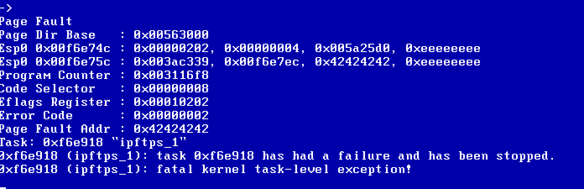
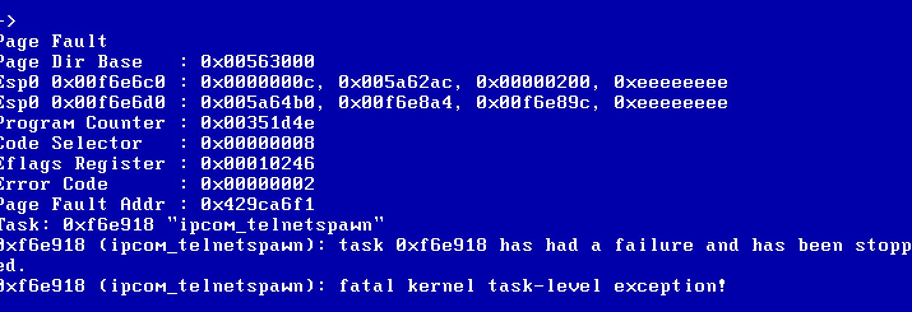

## CVE-2019-12255
VxWorks TCP Urgent pointer = 0 integer underflow 

## Discovered By
Armis Security

## Vulnerability Summary
The vulnerability exists in the IPnet stack of VxWorks. The details of the vulnerability can be found [here](https://i.blackhat.com/USA-19/Thursday/us-19-Seri-Critical-Zero-Days-Remotely-Compromise-The-Most-Popular-Real-Time-OS-wp.pdf). The PoC can crash VxWorks tasks(set the port corresponding to the task in the PoC), such as telnet, ftp, etc.

